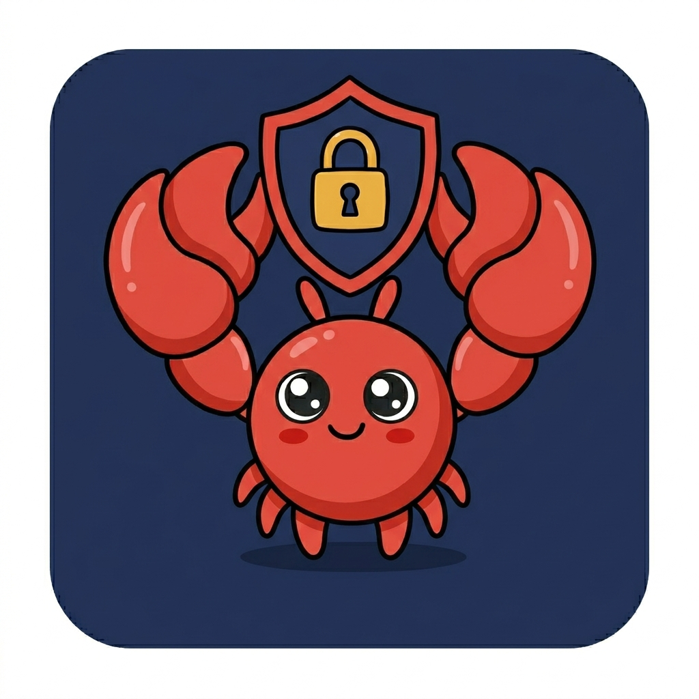

<p align="center">
  
</p>

# 🔐 Token Safety Checker

**Safe claws don't leak.**

Most OpenClaw users don't realize their API keys and bot tokens are sitting in plain text inside `openclaw.json`. This skill finds them and locks them down — automatically, locally, with zero data sent anywhere.

- ✅ **We never read your tokens** — the scanner reports field names and lengths only
- ✅ **Runs 100% on your local machine** — no network calls, no telemetry, no cloud
- ✅ **Non-destructive** — backs up your config before touching anything
- ✅ **Reversible** — one command to roll back if something goes wrong

---

## Install

```bash
clawhub install token-safety-checker
```

## Usage

Just ask your OpenClaw agent:

> "Check token safety"  
> "Scan my openclaw config for plaintext secrets"  
> "Move my tokens to env vars"

The agent will scan, show you exactly what it found, ask for confirmation, then migrate everything safely.

## What it does

1. **Scans** `openclaw.json` for plaintext credentials (tokens, API keys, passwords)
2. **Shows** you which fields are exposed — no values printed, just field names
3. **Backs up** your config before making any changes
4. **Migrates** secrets to environment variables in your shell profile
5. **Updates** `openclaw.json` to use SecretRef pointers instead of raw values
6. **Warns** you about the right restart steps for your setup (shell / systemd / Docker)

## Supported shells

| Shell | Profile file |
|-------|-------------|
| zsh   | `~/.zshrc` |
| bash  | `~/.bashrc` / `~/.bash_profile` |
| fish  | `~/.config/fish/config.fish` |
| sh / dash | `~/.profile` |

## Contributing

PRs welcome. See [SKILL.md](SKILL.md) for the full workflow spec.

## License

MIT

---

# 🔐 Token 安全检查器

**Safe claws don't leak. 🦀 安全的爪子不会泄漏。**

大多数 OpenClaw 用户不知道，自己的 API Key 和 Bot Token 正以明文形式躺在 `openclaw.json` 里。这个 skill 会自动找到它们，并在本地完成保护——零数据上传，全程不联网。

- ✅ **我们不读取你的 Token 值** — 扫描器只报告字段名称和长度，不输出任何实际值
- ✅ **100% 本地运行** — 无网络请求、无遥测、无云端处理
- ✅ **无损操作** — 修改前自动备份配置文件
- ✅ **可回滚** — 一条命令恢复到操作前的状态

---

## 安装

```bash
clawhub install token-safety-checker
```

## 使用方式

直接告诉你的 OpenClaw agent：

> "检查一下 token 安全"  
> "扫描 openclaw 配置里的明文 secret"  
> "把我的 token 移到环境变量里"

Agent 会扫描、展示发现的问题、等你确认，然后安全完成迁移。

## 工作流程

1. **扫描** `openclaw.json` 中的明文凭据（token、API key、password 等）
2. **展示** 暴露的字段——只显示字段名，不输出任何值
3. **备份** 修改前自动生成 `openclaw.json.bak`
4. **迁移** 将 secret 写入 shell profile 的环境变量
5. **更新** `openclaw.json`，用 SecretRef 指针替换明文值
6. **提示** 针对你的环境（shell / systemd / Docker）给出正确的重启步骤

## 支持的 Shell

| Shell | Profile 文件 |
|-------|-------------|
| zsh   | `~/.zshrc` |
| bash  | `~/.bashrc` / `~/.bash_profile` |
| fish  | `~/.config/fish/config.fish` |
| sh / dash | `~/.profile` |

## 参与贡献

欢迎提 PR。完整工作流说明见 [SKILL.md](SKILL.md)。

## 许可证

MIT
